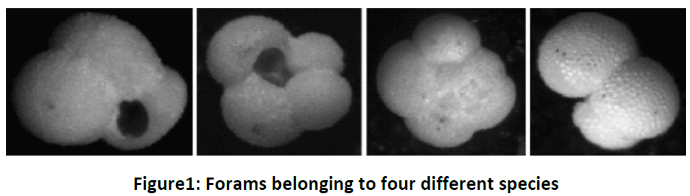
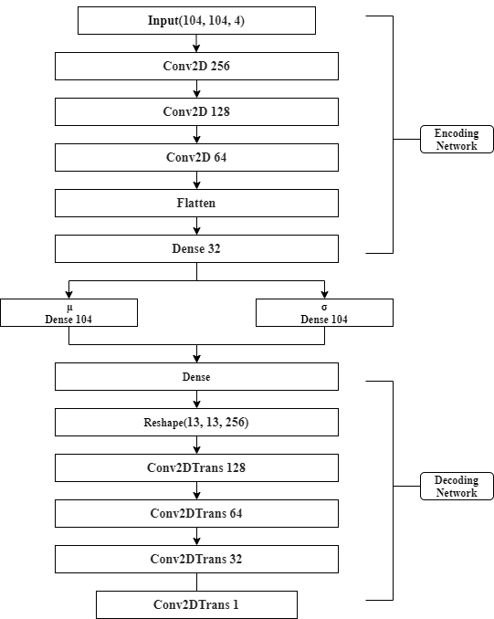
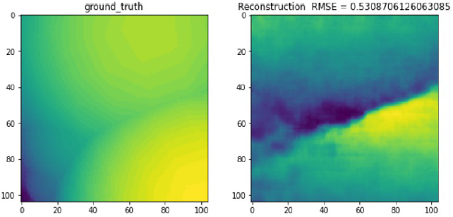
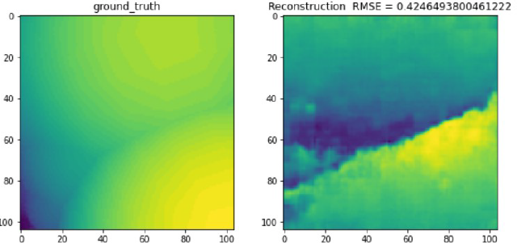

# Foram-View-Generation
## Background
Foraminifera (in short forams) are single celled organisms that are found in abundance throughout the world’s oceans. Researchers study the abundance of these organisms and the 
presence or absence of certain species to describe environmental conditions such as salinity and temperature of ocean, climatic changes, biostratigraphy, age dating and 
correlation of sediments as well as rates and patterns of evolution. A crucial part of their research is collection and classification of species as well as understanding their 
morphology.

Deep generative models can be used to learn structure embedded in latent space to aid in foram species classification. These models can be trained to both generate new samples 
to complement existing datasets as well as reconstruct 3D shapes of forams from 2D images to improve classification task of species.

## Data
2D Synthetic images of forams belonging to different classes and their corresponding ground truth depth maps.
You can access the .npy files here: https://1drv.ms/u/s!Aubhsxx6yKxgpqdut1fR8M9jm4xPtw?e=J8XmbE

## Methodology
We chose to implement the Variational Autoencoder (VAE) to train, test, and evaluate the data. Figure 2 is the structure of the VAE model.
<figure>
  
  <figcaption><b>Figure 2: VAE structure</b></figcaption>
</figure>

## Model Evaluation
The model was evaluated based on the RMSE and the visual comparison between generated forams and the ground truth. The model was trained in 20 epochs and 500 epochs, and 
Figure 3 and 4 show the generations of the validation set. As we can tell, more training epochs result in lower RMSE for foram generation.
<figure>
  
  <figcaption><b>Figure 3: 20 epochs</b></figcaption>
</figure>
<figure>
  
  <figcaption><b>Figure 4: 500 epochs</b></figcaption>
</figure>
